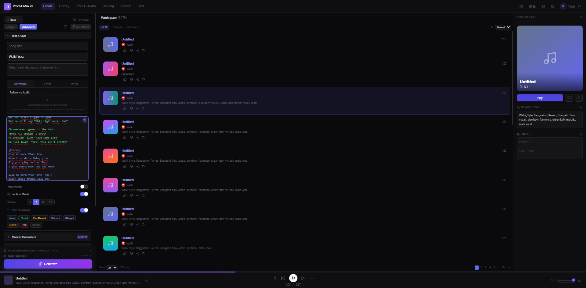

<h1 align="center">🎛️ ProdIA-MAX</h1>

<p align="center">
  <strong>Enhanced fork of ACE-Step UI — AI Music Production Suite for Windows</strong><br>
  <em>Fork mejorado de ACE-Step UI — Suite de producción musical con IA para Windows</em>
</p>

<p align="center">
  
  
  
  
</p>

<p align="center">
  
</p>

---

## 🙏 Credits / Créditos

> **ProdIA-MAX is a fork and extension of [ACE-Step UI](https://github.com/fspecii/ace-step-ui) by [fspecii](https://github.com/fspecii).**  
> All original UI code, architecture, and design belong to their respective authors.  
> This project adds Windows-specific tooling and production-focused enhancements on top of their work.

> **ProdIA-MAX es un fork y extensión de [ACE-Step UI](https://github.com/fspecii/ace-step-ui) creado por [fspecii](https://github.com/fspecii).**  
> Todo el código UI original, arquitectura y diseño pertenecen a sus respectivos autores.  
> Este proyecto añade herramientas optimizadas para Windows y mejoras orientadas a producción musical.

| Component | Author | License | Link |
|-----------|--------|---------|------|
| **ACE-Step UI** (base UI) | [fspecii](https://github.com/fspecii) | MIT | [github.com/fspecii/ace-step-ui](https://github.com/fspecii/ace-step-ui) |
| **ACE-Step 1.5** (AI model) | [ACE-Step Team](https://github.com/ace-step) | MIT | [github.com/ace-step/ACE-Step-1.5](https://github.com/ace-step/ACE-Step-1.5) |
| **ProdIA-MAX** (this fork) | [ElWalki](https://github.com/ElWalki) | MIT | — |
| **i18n system & translations** | [scruffynerf](https://github.com/scruffynerf) | MIT | [PR #1](https://github.com/ElWalki/ProdIA_Max-Ace-Step-UI_Ace-Step-v1.5/pull/1) |

---

## 🚀 What is ProdIA-MAX? / ¿Qué es ProdIA-MAX?

**EN:** ProdIA-MAX is a Windows-optimized fork of ACE-Step UI that bundles extra production tools: BPM/key detection, automatic lyric transcription, vocal/instrumental separation, LoRA training preparation, and one-click launchers — all wired to the ACE-Step 1.5 AI music generation engine.

**ES:** ProdIA-MAX es un fork de ACE-Step UI optimizado para Windows que incluye herramientas extra de producción: detección de BPM y tonalidad, transcripción automática de letras, separación vocal/instrumental, preparación para entrenamiento LoRA y lanzadores con un solo clic — todo integrado con el motor de generación musical IA ACE-Step 1.5.

---

## ✨ MAX Additions / Añadidos MAX

### 🎵 Generation & Audio
| Feature | Status | Description |
|---------|--------|-------------|
| **Vocal Separation (Demucs)** | ✅ Beta | Separate vocals/instrumental from any song |
| **Vocal Reference Tab** | ✅ | Dedicated vocal reference panel |
| **Independent Audio Strengths** | ✅ | Separate reference + source strength sliders |
| **Audio Codes System** | ✅ | Full semantic audio code pipeline — extract, apply & condition generation |
| **Mic Recorder + Audio Codes** | ✅ | Record voice → auto-extract Audio Codes + optional Whisper transcription |
| **Whisper Model Selector** | ✅ | Choose Whisper model (tiny→turbo) with download status indicators |
| **Process + Whisper / Solo Procesar** | ✅ | Two-button workflow: extract codes with or without lyric transcription |
| **Chord Progression Editor** | ✅ | Interactive chord builder with scale-aware suggestions and audio preview |
| **1/4 Time Signature** | ✅ | Added 1/4 time signature option to all time signature selectors |

### 🤖 AI Assistant & UX
| Feature | Status | Description |
|---------|--------|-------------|
| **Chat Assistant** | ✅ | Built-in AI assistant (OpenRouter/local LLM) for music production guidance |
| **LLM Provider Selector** | ✅ | Switch between OpenRouter models or local LLM endpoints |
| **Language Selector** | ✅ | Full i18n — switch UI language (ES/EN/+more) |
| **Sidebar Info Panel** | ✅ | Click info icons → scrollable info panel in sidebar (no clipping) |
| **Professional Audio Player** | ✅ | Enhanced player with playback speed, shuffle, repeat modes |
| **Song Cards & Drag-Drop** | ✅ | Visual song cards with drag-and-drop to playlists |
| **Resizable Chat Panel** | ✅ | Drag to resize chat assistant panel |
| **Style Editor** | ✅ | Edit and manage generation style presets |

### 🔧 Production Tools
| Feature | Status | Description |
|---------|--------|-------------|
| **Audio Metadata Tagging** | ✅ | ID3 tags (title, artist, BPM, key) in MP3s |
| **Edit Metadata** | ✅ | Edit BPM, key, time signature, title in-app |
| **LoRA Quick Unload** | ✅ | One-click unload on collapsed LoRA panel |
| **Time Signature Labels** | ✅ | Proper 1/4, 2/4, 3/4, 4/4, 5/4, 6/8, 7/8, 8/8 notation |
| **Prepare for Training** | ✅ Beta | Quick button to prep songs for LoRA training |
| **VRAM Safety** | ✅ | Generation locked during Demucs separation |
| **BPM & Key Detection** | ✅ | `detectar_bpm_clave.py` — batch detect BPM/key |
| **Lyric Transcription** | ✅ | `transcribir_letras.py` — Whisper-based transcription |
| **Caption Tools** | ✅ | Apply/truncate training captions automatically |
| **One-click Windows launchers** | ✅ | `.bat` scripts for setup, launch, and cleanup |

---

## 🏆 Best Quality Settings / Mejores Ajustes de Calidad

> **IMPORTANT / IMPORTANTE:** Audio generation quality is **dramatically better** using the **base model at 124 inference steps** compared to turbo mode (8 steps). While turbo is faster (~3-5s per song), the base model at 124 steps produces significantly richer, more coherent, and higher-fidelity audio.
>
> **La calidad de generación de audio es MUCHÍSIMO mejor usando el modelo base a 124 pasos** en comparación con el modo turbo (8 pasos). Aunque turbo es más rápido (~3-5s por canción), el modelo base a 124 pasos produce audio significativamente más rico, más coherente y de mayor fidelidad.

| Setting | Turbo (fast) | **Base (recommended)** |
|---------|-------------|----------------------|
| Model | `turbo` | **`base`** |
| Inference Steps | 8 | **124** |
| Speed (30s song) | ~3-5s | ~45-90s |
| Quality | Good | **Excellent** ⭐ |
| Coherence | Decent | **Very high** |
| Recommended for | Quick previews | **Final production** |

---

## 📋 Requirements / Requisitos

| Requirement | Minimum | Recommended |
|-------------|---------|-------------|
| OS | Windows 10 / Linux / macOS | Windows 11 |
| GPU VRAM | 4 GB | 12 GB+ |
| Python | 3.10 | **3.11** |
| Node.js | 18 | 20+ |
| CUDA | — | 12.8 |
| Disk Space | ~15 GB (required models) | ~40 GB (all models) |

---

## 🔧 Installation / Instalación

### What you MUST install manually / Lo que DEBES instalar manualmente

You only need **3 things** installed before running ProdIA-MAX. Everything else is automatic.  
Solo necesitas **3 cosas** instaladas antes de ejecutar ProdIA-MAX. Todo lo demás es automático.

#### 1. Python 3.11

**EN:** Download from [python.org](https://www.python.org/downloads/). During installation, check **"Add Python to PATH"** — this is critical.  
**ES:** Descarga desde [python.org](https://www.python.org/downloads/). Durante la instalación, marca **"Add Python to PATH"** — esto es esencial.

> ⚠️ Python **3.11** is strongly recommended. The `pyproject.toml` locks to `==3.11.*` and some dependencies (like `flash-attn`) only have pre-built wheels for 3.11.

#### 2. Node.js 18+

**EN:** Download from [nodejs.org](https://nodejs.org/) (LTS recommended). This powers the backend server and both frontends.  
**ES:** Descarga desde [nodejs.org](https://nodejs.org/) (recomendado LTS). Esto ejecuta el servidor backend y ambas interfaces.

#### 3. NVIDIA GPU + CUDA Drivers

**EN:** You need an NVIDIA GPU with updated drivers. CUDA 12.8 compatible drivers are required — PyTorch will be installed with CUDA 12.8 support automatically. Without an NVIDIA GPU, the app **cannot generate music**.  
**ES:** Necesitas una GPU NVIDIA con drivers actualizados. Se requieren drivers compatibles con CUDA 12.8 — PyTorch se instalará con soporte CUDA 12.8 automáticamente. Sin GPU NVIDIA, la app **no puede generar música**.

> 💡 **Git** is only needed if you clone the repo. If you download the ZIP, Git is not required.  
> 💡 **Git** solo es necesario si clonas el repo. Si descargas el ZIP, no necesitas Git.

### Verify installation / Verificar instalación

```bat
python --version    REM Should show 3.11.x
node --version       REM Should show v18+ or v20+
nvidia-smi           REM Should show your GPU and driver version
```

---

## ⚡ Quick Start / Inicio rápido

### Windows

```bat
REM Option 1: Launch everything (Classic UI + Pro UI + AI engine)
iniciar_todo.bat

REM Option 2: Launch Pro UI only (recommended)
iniciar_pro.bat
```

### Linux / macOS

```bash
chmod +x iniciar_todo.sh
./iniciar_todo.sh
```

### What opens / Qué se abre

| Launcher | URL | Description |
|----------|-----|-------------|
| `iniciar_todo.bat` | http://localhost:3000 | Classic UI (+ Pro UI on :3002) |
| `iniciar_pro.bat` | http://localhost:3002 | Pro UI only (recommended) |

---

## 🚀 First Run — What Happens Automatically / Primera ejecución — Qué pasa automáticamente

**EN:** The first time you run `iniciar_todo.bat` or `iniciar_pro.bat`, the script will automatically:

**ES:** La primera vez que ejecutes `iniciar_todo.bat` o `iniciar_pro.bat`, el script automáticamente:

| Step | What it does | Time (est.) |
|------|-------------|-------------|
| 1️⃣ | **Creates Python virtual environment** (`.venv` inside `ACE-Step-1.5_/`) | ~10 sec |
| 2️⃣ | **Installs Python dependencies** via `pip install -r requirements.txt` — PyTorch (CUDA 12.8), Transformers, Gradio, etc. | ~5-15 min |
| 3️⃣ | **Installs Node.js dependencies** via `npm install` in 3 folders (ace-step-ui, ace-step-ui/server, ace-step-ui-pro) | ~2-5 min |
| 4️⃣ | **Downloads AI models** from HuggingFace (~9.6 GB for required models) | ~10-30 min |
| 5️⃣ | **Starts all services** and opens your browser | ~30 sec |

> ⏱️ **Total first run time: ~20-50 minutes** depending on your internet speed. Subsequent runs start in ~30 seconds.  
> ⏱️ **Tiempo total primera ejecución: ~20-50 minutos** dependiendo de tu velocidad de internet. Las siguientes ejecuciones arrancan en ~30 segundos.

A marker file `.deps_installed` is created after successful installation — subsequent runs skip the install step unless `requirements.txt` changes.

---

## 🧠 AI Models / Modelos de IA

All models are downloaded from **HuggingFace** automatically on first run. They are stored in `ACE-Step-1.5_/checkpoints/`.

### Required models (auto-downloaded) / Modelos requeridos (descarga automática)

| Model | Size | VRAM | Purpose / Propósito |
|-------|------|------|---------------------|
| `acestep-v15-turbo` | ~4.5 GB | ~4 GB | Default generation model (diffusion transformer) |
| `vae` | ~500 MB | ~1 GB | Audio encoder/decoder |
| `Qwen3-Embedding-0.6B` | ~1.2 GB | ~1 GB | Text encoder for lyrics/tags |
| `acestep-5Hz-lm-1.7B` | ~3.4 GB | ~4 GB | Language model for music structure |
| **Total** | **~9.6 GB** | | |

### Optional models (manual download) / Modelos opcionales (descarga manual)

Use `verificar_modelos.bat` to check which models you have and download extras:  
Usa `verificar_modelos.bat` para ver qué modelos tienes y descargar extras:

| Model | Size | VRAM | Purpose / Propósito |
|-------|------|------|---------------------|
| `acestep-v15-base` | ~4.5 GB | ~4 GB | Base model — 124 steps, highest quality ⭐ |
| `acestep-v15-sft` | ~4.5 GB | ~4 GB | Fine-tuned variant |
| `acestep-v15-turbo-shift1` | ~4.5 GB | ~4 GB | Turbo variant 1 |
| `acestep-v15-turbo-shift3` | ~4.5 GB | ~4 GB | Turbo variant 3 |
| `acestep-v15-turbo-continuous` | ~4.5 GB | ~4 GB | Continuous generation mode |
| `acestep-5Hz-lm-0.6B` | ~1.2 GB | ~3 GB | Small LM (less VRAM) |
| `acestep-5Hz-lm-4B` | ~7.8 GB | ~12 GB | Large LM (best quality lyrics) |

> 💡 **VRAM recommendation:** 8 GB VRAM for turbo mode, 12 GB+ for base model at 124 steps with the 4B language model.  
> 💡 **Recomendación VRAM:** 8 GB VRAM para modo turbo, 12 GB+ para modelo base a 124 pasos con el modelo de lenguaje 4B.

All models come from HuggingFace repos under `ACE-Step/` — no account or token needed.  
Todos los modelos vienen de repos HuggingFace bajo `ACE-Step/` — no se necesita cuenta ni token.

---

## 📁 Project Structure / Estructura del proyecto

```
ProdIA-MAX/
│
├── ACE-Step-1.5_/              # ACE-Step 1.5 AI engine (original, MIT)
│   ├── acestep/                #   Core Python inference code
│   ├── requirements.txt        #   ★ Python dependencies (PyTorch, Gradio, etc.)
│   └── ...
│
├── ace-step-ui/                # Base UI fork from fspecii (original, MIT)
│   ├── server/                 #   Express + SQLite backend (Node.js)
│   ├── package.json            #   Node.js dependencies (backend + frontend)
│   └── ...
│
├── ace-step-ui-pro/            # ProdIA-MAX Pro UI (React 19 + Vite + Tailwind v4)
│   ├── src/                    #   TypeScript source code
│   │   ├── components/         #     React components (views, create, ui, layout)
│   │   ├── services/           #     API clients, chord service, etc.
│   │   ├── i18n.ts             #     Internationalization (EN/ES)
│   │   └── App.tsx             #     Main application entry
│   ├── package.json            #   Node.js dependencies (frontend)
│   └── ...
│
├── i18n/                       # i18n utilities & locale files
│   ├── locales/                #   Translation JSON files
│   └── utils.py                #   i18n helper scripts
│
├── IMAGES/                     # Screenshots & product images
│   └── main.png                #   Main product screenshot
│
├── SecurityScan/               # Security tools
│   ├── escanear_seguridad.bat  #   Run security scan (Windows)
│   ├── limpiar_kms.bat         #   KMS cleanup
│   └── LEEME.md                #   Security scan documentation
│
├── backups/                    # Session backups
│
│── ★ MAX Production Tools ──────────────────────────────
├── aplicar_captions_v3.py      # Auto-apply training captions
├── detectar_bpm_clave.py       # BPM & key detection (librosa)
├── transcribir_letras.py       # Lyric transcription (Whisper)
├── transcribir_letras_v2.py    # Lyric transcription v2
├── truncar_captions.py         # Caption truncation helper
├── check_genres.py             # Genre validator
├── check_tensors.py            # Tensor/model inspector
│
│── ★ Launchers (Windows) ───────────────────────────────
├── iniciar_todo.bat            # One-click launcher (backend + frontend + AI)
├── iniciar_pro.bat             # Launch Pro UI only
├── verificar_modelos.bat       # Model verification
├── limpiar_datos_usuario.bat   # Clean user data
├── desinstalar.bat             # Uninstall / cleanup
├── transcribir_letras.bat      # Transcribe lyrics launcher
│
│── ★ Launchers (Linux/macOS) ───────────────────────────
├── setup.sh                    # First-time setup
├── iniciar_todo.sh             # One-click launcher
├── iniciar_pro.sh              # Launch Pro UI only
├── iniciar_acestep_ui.sh       # Launch base UI
├── verificar_modelos.sh        # Model verification
├── limpiar_datos_usuario.sh    # Clean user data
├── desinstalar.sh              # Uninstall / cleanup
├── detectar_bpm_clave.sh       # BPM & key detection
├── transcribir_letras.sh       # Transcribe lyrics
│
│── ★ Documentation ─────────────────────────────────────
├── README.md                   # This file
├── SINGER_LIBRARY_SPEC.md      # Singer library specification
├── i18nHowTo.md                # i18n guide (English)
└── i18nHowTo_es.md             # i18n guide (Spanish)
```

---

## 🎼 Audio Codes System / Sistema de Códigos de Audio

ACE-Step uses **semantic audio codes** — tokens at 5Hz that encode melody, rhythm, structure, and timbre holistically. Each code (`<|audio_code_N|>`, N=0–63999) represents 200ms of audio.

**How to use:**
1. Load audio in **Source Audio** → click **"Convert to Codes"** → codes appear in the Audio Codes field
2. Or use the **Voice Recorder** → "Process + Whisper" extracts codes automatically
3. Write a **different text prompt** (e.g., change genre/style)
4. Adjust **audio_cover_strength** (0.3–0.5 = new style with original structure)
5. Generate → the model follows the code structure but with your new style

| Property | Value |
|----------|-------|
| Rate | 5 codes/second (200ms each) |
| Codebook size | 64,000 (FSQ: [8,8,8,5,5,5]) |
| 30s song | ~150 codes |
| 60s song | ~300 codes |
| Quantizer | Finite Scalar Quantization (1 quantizer, 6D) |

> **Note:** Individual codes encode ALL musical properties simultaneously (melody + rhythm + timbre). You cannot isolate rhythm from melody at the code level, but you can use codes as structural guidance while the text prompt controls style/instrumentation.

---

## 🎙️ Voice Recorder Workflow / Flujo del Grabador de Voz

1. **Record** your voice/humming/beatbox
2. Choose a **Whisper model** (tiny→turbo) — download status shown with ✓/↓ indicators
3. Click **"Procesar + Whisper"** → extracts Audio Codes AND transcribes lyrics
4. Or click **"Solo Procesar"** → extracts Audio Codes only (faster, no transcription)
5. Click **"Aplicar"** → codes + lyrics are applied to the Create Panel
6. The generation will use your voice structure as a musical guide

---

## �️ Scripts Reference / Referencia de Scripts

### Main Launchers / Lanzadores principales

| Script | What it does / Qué hace |
|--------|-------------------------|
| `iniciar_todo.bat` | **Full launch**: installs deps if needed → starts AI engine (port 8001) → backend (port 3001) → Classic UI (port 3000) → Pro UI (port 3002) → opens browser |
| `iniciar_pro.bat` | **Pro launch**: same as above but skips Classic UI — only AI engine + backend + Pro UI |
| `iniciar_todo.sh` | **Linux/macOS** equivalent of `iniciar_todo.bat` |

### Utility Scripts / Scripts de utilidad

| Script | What it does / Qué hace |
|--------|-------------------------|
| `verificar_modelos.bat` | Checks which AI models are installed and offers to download missing ones from HuggingFace |
| `transcribir_letras.bat` | Launches the lyrics transcription tool (uses Demucs for stem separation + Whisper for transcription). 6 quality modes available |
| `limpiar_datos_usuario.bat` | Deletes user data only (database + generated audio). Keeps models, code, and dependencies |
| `desinstalar.bat` | Full uninstall — removes `.venv`, all `node_modules`, database, and generated audio. Keeps models and source code |

### Internal Scripts (ACE-Step-1.5_/) / Scripts internos

| Script | What it does / Qué hace |
|--------|-------------------------|
| `_start_gradio_api.bat` | Starts only the Gradio AI engine on port 8001 |
| `_start_backend.bat` | Starts only the Node.js backend on port 3001 |
| `_start_frontend.bat` | Starts only the Classic UI on port 3000 |
| `iniciar_acestep.bat` | Interactive menu: standalone Gradio UI (port 7860), API mode, model download, advanced config |

### Production Tools / Herramientas de producción

| Script | What it does / Qué hace |
|--------|-------------------------|
| `detectar_bpm_clave.py` | Batch detect BPM and musical key of audio files |
| `transcribir_letras.py` | Transcribe lyrics from audio using Whisper |
| `aplicar_captions_v3.py` | Apply training captions to audio files for LoRA preparation |
| `truncar_captions.py` | Truncate captions to fit training requirements |
| `check_genres.py` | Validate genre tags in audio files |
| `check_tensors.py` | Inspect model tensor files |

---

## 🔌 Ports / Puertos

| Port | Service | Description |
|------|---------|-------------|
| **8001** | Gradio API | ACE-Step AI music generation engine |
| **3001** | Express.js Backend | Auth, model management, audio serving, database |
| **3000** | Classic Frontend | Legacy React UI (Vite dev server) |
| **3002** | Pro Frontend | ProdIA-MAX Pro UI (Vite + React 19 + Tailwind v4) |
| **7860** | Gradio Native UI | Only used with `iniciar_acestep.bat` standalone mode |

> All ports are killed automatically before launch to avoid conflicts. The scripts handle this for you.  
> Todos los puertos se liberan automáticamente antes del lanzamiento para evitar conflictos.

---

## ❓ Troubleshooting / Solución de problemas

### "Python not found" / "No se encuentra Python"
- Make sure Python 3.11 is installed and **added to PATH**
- Run `python --version` in a terminal to verify
- If you have multiple Python versions, ensure 3.11 is the default

### "Node.js not found" / "No se encuentra Node.js"
- Install Node.js from [nodejs.org](https://nodejs.org/)
- Restart your terminal after installing
- Run `node --version` to verify

### "CUDA out of memory" / "Sin memoria CUDA"
- Use a smaller language model (`0.6B` instead of `1.7B` or `4B`)
- Use turbo mode instead of base model
- Close other GPU-intensive applications
- Check your VRAM with `nvidia-smi`

### Models not downloading / Los modelos no se descargan
- Check your internet connection
- Run `verificar_modelos.bat` to manually download models
- Models are downloaded from HuggingFace — no VPN restrictions needed
- If download was interrupted, delete the incomplete folder in `ACE-Step-1.5_/checkpoints/` and retry

### Port already in use / Puerto en uso
- The launcher scripts auto-kill processes on required ports
- If you still get errors, manually close any process using ports 8001, 3001, 3000, or 3002
- On Windows: `netstat -ano | findstr :PORT_NUMBER` then `taskkill /PID <PID> /F`

### Audio doesn't generate / No se genera audio
- Ensure the Gradio API started successfully (check the terminal window titled "Gradio API")
- Wait for the message "Running on local URL: http://127.0.0.1:8001" before trying to generate
- The first generation takes longer as PyTorch compiles kernels

### Fresh start / Empezar de cero
```bat
REM Remove all installed dependencies (keeps models and code)
desinstalar.bat

REM Then relaunch — everything reinstalls automatically
iniciar_todo.bat
```

---

## �📄 License / Licencia

This project is distributed under the **MIT License**.  
Este proyecto se distribuye bajo la **Licencia MIT**.

- The original **ACE-Step UI** code remains © [fspecii](https://github.com/fspecii) under MIT.  
- The **ACE-Step 1.5** model and backend remain © [ACE-Step Team](https://github.com/ace-step) under MIT.  
- New additions and modifications in this fork are © [ElWalki](https://github.com/ElWalki) under MIT.

See [ACE-Step-1.5_/LICENSE](ACE-Step-1.5_/LICENSE) for the full license text.

---

<p align="center">
  Built on top of the amazing work of <a href="https://github.com/fspecii/ace-step-ui">fspecii</a> and the <a href="https://github.com/ace-step/ACE-Step-1.5">ACE-Step team</a>.<br>
  i18n system & translations contributed by <a href="https://github.com/scruffynerf">scruffynerf</a>.<br>
  <em>Stop paying subscriptions. Start creating with ACE-Step.</em>
</p>
